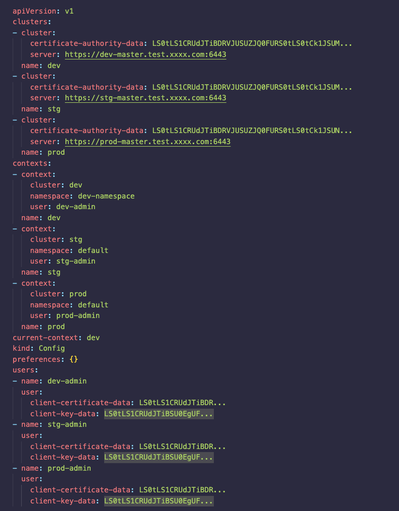

To effectively master the `kubeconfig` and its usage within Kubernetes, we can delve into specific tasks and commands that Site Reliability Engineers (SREs) frequently encounter. Here's an enriched and detailed breakdown of the mentioned tasks, complete with examples and recommended commands:

**Task 1: Obtaining the Kubeconfig File**

**Action Steps:**

1. After deploying your Kubernetes cluster, you can retrieve the `kubeconfig` file typically from the master node. It's usually located at `~/.kube/config`.
2. You can also use the following command to set the `KUBECONFIG` environment variable for easy access:
```
export KUBECONFIG=/path/to/your/kubeconfig
```

**Task 2: Managing Users and Contexts**
Managing different users and contexts within a single cluster and merging multiple `kubeconfig` files into one are common tasks.

**Action Steps:**

1. To define different users and contexts, you can edit the `kubeconfig` file or use `kubectl config` commands to set users, contexts, and clusters:
```
kubectl config set-context my-context --cluster=my-cluster --user=my-user --namespace=my-namespace
```
2. To merge multiple `kubeconfig` files, use the `KUBECONFIG` environment variable and the `kubectl config view --merge` command:
```
export KUBECONFIG=kubeconfig1:Kubeconfig2
kubectl config view --merge --flatten > merged_kubeconfig
```

3. If you prefer not to merge, use tools like `kubectx` and `kubens` for switching between clusters and namespaces.

**Task 3: Setting up CI/CD Users and retrieving its Kubeconfig info**
1. Create a `ServiceAccount` and bind it to a `ClusterRole` using a `ClusterRoleBinding` for broad permissions across namespaces:

```
apiVersion: v1
kind: ServiceAccount
metadata:
  name: gitlab
secrets:
  - name: gitlab-token
---
apiVersion: rbac.authorization.k8s.io/v1
kind: ClusterRoleBinding
metadata:
  name: gitlab
roleRef:
  apiGroup: rbac.authorization.k8s.io
  kind: ClusterRole
  name: admin
subjects:
  - kind: ServiceAccount
    name: gitlab
---
apiVersion: rbac.authorization.k8s.io/v1
kind: ClusterRole
metadata:
  name: admin
# IMPORTANT: The permissions granted by this ClusterRole are extensive and provide full access to all resources.
# It is crucial to modify these permissions based on the actual security requirements of your environment.
rules:
  - apiGroups: ["*"]  # Allows access to all API groups
    resources: ["*"]  # Allows access to all resources
    verbs: ["*"]      # Allows all actions (create, delete, get, list, watch, update, patch)
---
apiVersion: v1
kind: Secret
metadata:
  name: gitlab-token
annotations:
  kubernetes.io/service-account.name: gitlab
type: kubernetes.io/service-account-token

```
2. Retrieve the Kubernetes API server endpoint, the CA certificate (`ca.crt`), and the token from the secret using the following commands
```
# Get Kubernetes API server endpoint
kubectl cluster-info | grep 'Kubernetes' | awk '{print $NF}'

# Get CA certificate and decode it
kubectl get secret gitlab-token -o jsonpath="{.data['ca\.crt']}" | base64 --decode > ca.crt

# Get token and decode it
kubectl get secret gitlab-token -o json | jq .data.token -r | base64 --decode
```
3. After obtaining the API server endpoint, CA certificate, and token, follow these steps to integrate them into your CI/CD server (e.g., GitLab or GitHub):

- **API Server Endpoint**: Enter the endpoint into your CI/CD project's Kubernetes configuration section.
- **CA Certificate (`ca.crt`)**: Upload the decoded `ca.crt` file to the appropriate section in the Kubernetes integration settings.
- **Token**: Use the decoded token for authentication when setting up the Kubernetes integration in your CI/CD environment.

These details will enable secure communication between your CI/CD server and the Kubernetes cluster, facilitating automated deployment processes.

**Task 4: Granting Namespace-specific Permissions kubeconfig**
1. Creating RABC for a customer that limits them to a specific namespace involves setting roles and role bindings.
```
apiVersion: v1
kind: ServiceAccount
metadata:
  name: customer-user
  namespace: customer-ns
secrets:
  - name: customer-user-token
# in some k8s versions, automountServiceAccountToken: true feature will create the token for the serviveaccount directly
---
apiVersion: v1
kind: Secret
metadata:
  name: customer-user-token
  namespace: customer-ns
  annotations:
    kubernetes.io/service-account.name: customer-user
type: kubernetes.io/service-account-token

---
apiVersion: rbac.authorization.k8s.io/v1
kind: Role
metadata:
  name: limited-role
  namespace: customer-ns
rules:
  - apiGroups: [""]
    resources: ["pods"]
    verbs: ["get", "list", "watch"]

---
apiVersion: rbac.authorization.k8s.io/v1
kind: RoleBinding
metadata:
  name: limited-role-binding
  namespace: customer-ns
subjects:
  - kind: ServiceAccount
    name: customer-user
    namespace: customer-ns
roleRef:
  kind: Role
  name: limited-role
  apiGroup: rbac.authorization.k8s.io
```

2. Create kubeconfig
   Here's a simple script snippet to generate a kubeconfig file for `customer-user`:
```
# Get the API server URL
APISERVER=$(kubectl config view --minify -o jsonpath='{.clusters[0].cluster.server}')
# Get the cluster name
CLUSTER_NAME=$(kubectl config view --minify -o jsonpath='{.clusters[0].name}')
# Create kubeconfig file
kubectl config set-cluster $CLUSTER_NAME --server=$APISERVER --certificate-authority=/path/to/ca.crt --embed-certs=true --kubeconfig=customer-kubeconfig
kubectl config set-credentials customer-user --token=$TOKEN --kubeconfig=customer-kubeconfig
kubectl config set-context default --cluster=$CLUSTER_NAME --user=customer-user --namespace=customer-ns --kubeconfig=customer-kubeconfig
kubectl config use-context default --kubeconfig=customer-kubeconfig

```

**Task5: Update the kubeconfig File after certificate renewal**
Renewing certificates on the control plane nodes in a Kubernetes cluster requires updating the `kubeconfig` file to reflect the changes, especially if the API server's certificate has been renewed.
1. Replace CA Certificate:
   After renewing the CA certificate, you need to update the `kubeconfig` file to trust the new CA. This step involves replacing the CA certificate in the `kubeconfig` file with the new one. You can manually edit the `kubeconfig` file and replace the content of `certificate-authority-data` with the base64 encoded form of your new CA certificate. Alternatively, use the following command if you have the path to the new CA certificate:
```
kubectl config set-cluster [CLUSTER_NAME] --certificate-authority=[/path/to/new/ca.crt] --embed-certs=true

```
2. Update Client Certificates and Keys (if client certs were used):
   If your `kubeconfig` uses client certificates for authentication (client-certificate-data and client-key-data), and these were also renewed, you need to update those in the `kubeconfig` as well. Update the client certificate and key with:
```
kubectl config set-credentials [USER_NAME] --client-certificate=[/path/to/new/client.crt] --client-key=[/path/to/new/client.key] --embed-certs=true

```

3. Verify the connectivity and check the permission you have:
```
kubectl get nodes
kubectl auth can-i --list
kubectl config view
kubectl config use-context

```