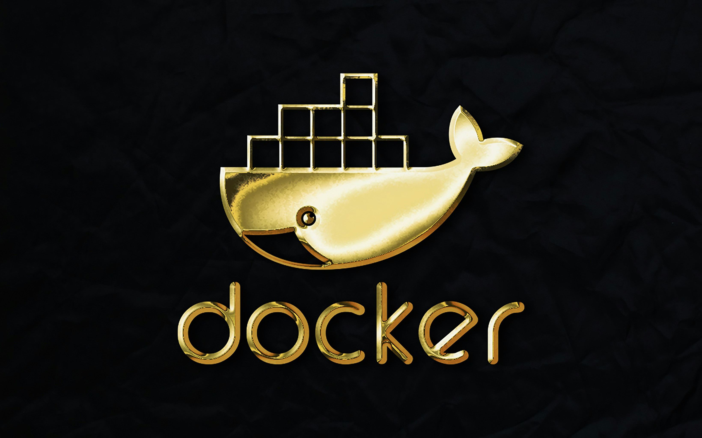

For developers delving into the world of Docker, starting with a robust Dockerfile is fundamental. Before drafting your Dockerfile, I recommend familiarizing yourself with the [Best Practices for Writing Dockerfiles](https://docs.docker.com/develop/develop-images/dockerfile_best-practices/) provided by Docker Documentation. 

Optimizing Dockerfiles is crucial; it involves more than simplifying the build process. It ensures that the Docker images produced are optimized for performance, security, and ease of maintenance. Below, I will explore comprehensive best practices to master your Docker configurations effectively, encompassing Dockerfile, docker-compose.yml, docker-entrypoint.sh, and .dockerignore files.

## Mastering dockerfile

1. **Combine Installation and Cleanup in a Single RUN Command:** Combining installation and cleanup steps into a single `RUN` command reduces the number of intermediate layers created, which minimizes the overall image size. Each `RUN` command adds a new layer to the image; hence, chaining commands using logical operators can help in reducing this effect.
```
FROM ubuntu:20.04
RUN apt-get update && apt-get install -y \
    curl \
    && rm -rf /var/lib/apt/lists/*
```
2. **Minimize the Number of Layers:** Minimize the use of `RUN`, `COPY`, and `ADD` commands to reduce the number of layers. Where possible, chain related commands together within a single `RUN` statement using logical operators and scripting.
```
FROM node:14
WORKDIR /app
COPY package.json yarn.lock ./
RUN yarn install --frozen-lockfile && yarn cache clean
COPY . .
```
3. **Strategically Organize Immutable Layers:** Place commands that are less likely to change (such as installing core libraries and frameworks) early in the Dockerfile. This takes advantage of Docker's cache to skip rebuilding these layers when no changes are detected.
```
FROM openjdk:11-jre
RUN apt-get update && apt-get install -y ffmpeg libopencv-dev
```
4. **Use LABEL for Metadata:** Use `LABEL` to add metadata to your Docker images, such as the maintainer, version, and other relevant information. This practice aids in the management and identification of images, especially in environments with many custom images.
```
FROM python:3.8-slim
LABEL maintainer="John Doe <john.doe@example.com>"
LABEL version="1.0.0"
LABEL description="Custom Python service."

```
5. **Prefer Named Volumes or Host Mounts over VOLUME Instruction:** Using the `VOLUME` instruction can lead to unused and dangling volumes if not managed carefully. Instead, specify volumes during container runtime with Docker Compose or Docker run commands to have more control over volume management.
```
# Docker Compose snippet
services:
  app:
    image: myapp
    volumes:
      - data_volume:/data
volumes:
  data_volume:

```
6. **Avoid Running Containers as root:** For security purposes, ensure containers run as a non-root user whenever possible. This helps prevent privilege escalation attacks if the container is compromised.
```
FROM node:14
RUN useradd -m myuser
USER myuser
WORKDIR /home/myuser/app
COPY --chown=myuser:myuser . .

```

7. **Minimize the Use of Environment-Sensitive Instructions:** Avoid using commands like `ENV` that introduce variability, as they can invalidate caches. When necessary, group environment variable settings with the commands that use them.
```
FROM python:3.8
ENV PYTHONDONTWRITEBYTECODE=1 \
    PYTHONUNBUFFERED=1
```

8. **Utilize `.dockerignore` File:** Just like a `.gitignore` file, a `.dockerignore` file can prevent unwanted files from being added to the Docker context, potentially speeding up builds and avoiding unnecessary cache invalidations.
```
node_modules
*.log
```
        
9.  **Multi-Stage Builds:** If building an application involves multiple steps, consider using multi-stage builds. This allows you to use different bases for different stages of the build, possibly reusing cached layers from other projects or stages.
```
# Stage 1: Build the application
FROM node:14 as builder
WORKDIR /app
COPY package*.json ./
RUN npm install
COPY . .
RUN npm run build

# Stage 2: Serve the application
FROM nginx:alpine
COPY --from=builder /app/build /usr/share/nginx/html

```
10. **Lint and Validate Your Dockerfiles**
Use tools like `hadolint` or `dockerfilelint` to analyze and validate your Dockerfiles. These tools help you identify common mistakes and enforce best practices.


## Mastering docker-compose.yml

Docker Compose is a tool for defining and running multi-container Docker applications. With Compose, you use a YAML file to configure your application’s services, networks, and volumes, and then use a single command to create and start all the services from your configuration

1. **Example of a docker-compose.yml File**
```
version: '3.8'  # Specifies the Docker Compose version

services:
  web:  # Defines a service named "web"
    build: ./app  # Path to the Dockerfile
    volumes:  # Mounts the project directory on the host to /app inside the container
      - ./app:/app
    ports:  # Exposes port 5000 on the container to port 5000 on the host
      - "5000:5000"
    depends_on:
      - redis  # Indicates that the web service depends on the redis service

  redis:
    image: "redis:alpine"  # Uses a pre-built Redis image from Docker Hub

networks:  # Optional networks section
  default:  # Uses the default network
    driver: bridge

volumes:  # Optional volumes section
  db_data:  # Defines a named volume that can be mounted to services

```

2. **Docker Compose Command**
- **`docker-compose up`**: Builds, (re)creates, starts, and attaches to containers for a service. When run without options, it starts all containers defined in the `docker-compose.yml`. With the `-d` flag, it starts the containers in the background (detached mode).
    
- **`docker-compose down`**: Stops and removes containers, networks, volumes, and images created by `up`.
    
- **`docker-compose build`**: Builds or rebuilds services specified in the `docker-compose.yml`.
    
- **`docker-compose logs`**: Displays log output from services.
    
- **`docker-compose restart`**: Restarts all stopped and running services.
    
- **`docker-compose exec`**: Executes a command in a running container.
    
- **`docker-compose stop`**: Stops running containers without removing them. They can be started again with `docker-compose start`.
    
- **`docker-compose start`**: Starts existing containers

- `docker-compose -f <DockerComposeFile> up`: Starts all containers as defined in the Docker Compose file.

- `docker-compose -f <DockerComposeFile> down`: Stops all containers and removes networks created by `up`.


3. **Best practices**
- **Volumes**: If your application requires persistent data, define volumes in your `docker-compose.yml` to ensure data persists across container restarts.
- **Environment Variables**: Manage environment variables using environment keys in the `docker-compose.yml` for development and staging. For production, consider using Docker secrets or other secure methods of managing sensitive data.
- **Networking**: Define custom networks to facilitate communication between containers, or use the default bridge network created by Docker Compose for simple scenarios.

## Mastering docker-entrypoint.sh

The `docker-entrypoint.sh` script typically acts as the primary executable when a Docker container starts. It is used to configure the environment, initialize settings, and run any preparatory tasks before the main application starts.

1. **Integration with Dockerfile example**
```
FROM python:3.8-slim
WORKDIR /app
COPY . /app
RUN chmod +x /app/docker-entrypoint.sh
ENTRYPOINT ["/app/docker-entrypoint.sh"]
CMD ["python", "app.py"]

```

2. **docker-entrypoint.sh example**
```
#!/bin/bash
set -e

# Checking if the APP_HOME environment variable is set
if [ -z "$APP_HOME" ]; then
  echo "APP_HOME not set"
  exit 1
fi

# Initialize log directory
if [ ! -d "$APP_HOME/logs" ]; then
  mkdir -p "$APP_HOME/logs"
fi

# Check for database availability
echo "Waiting for database to start..."
while ! nc -z $DB_HOST $DB_PORT; do   
  sleep 1 # wait for 1 second before check again
done

# Perform database migrations
echo "Performing database migrations..."
python manage.py migrate

# Start the main process using exec
exec "$@"

```

3. **Best Practices for docker-entrypoint.sh**

- **Use `set -e`**: This command causes the script to exit immediately if a command exits with a non-zero status, which helps in catching errors early.
    
- **Robust Error Handling**: Include error checks and meaningful messages for operations, especially for network dependencies and configuration issues.

- **Use Lightweight Operations**: Since the entrypoint script runs every time the container starts, keep operations lightweight and minimal.
    
- **Parameterize Scripts**: Allow custom parameters and environment variables to adjust behavior without modifying the script.
    
- **Secure Sensitive Data**: Avoid hardcoding sensitive data; use Docker secrets or environment variables.
    
- **Logging**: Output useful logs to stdout/stdout, which Docker handles natively.

## Mastering .dockerignore
Mastering the `.dockerignore` file is crucial for optimizing Docker builds by reducing the build context sent to the Docker daemon. This file works similarly to `.gitignore` in that it excludes files and directories that are not necessary for building a Docker image.
1. **Example of .dockerignore file**
```
# Ignore all files by default
**

# Allow files and directories necessary for the build
!Dockerfile
!src/
!lib/
!requirements.txt

# Exclude all hidden files and directories
.* 

```

2. **Common Practices**
- **Exclude large or unnecessary files:** Common examples include logs, temporary files, and local configuration files (`*.log`, `tmp/`, `config/`).
- **Environment-specific files:** Exclude files that are specific to development or testing environments, such as `node_modules/` or virtual environment directories (`venv/`).
- **Source control directories:** Often, it’s not necessary to include source control directories like `.git/` or `.svn/`.
- **Check the build context:** You can use `docker build --no-cache` to ensure that changes to the `.dockerignore` file are taking effect.


## Mastering Docker commands

#### **1. Docker Image Management**

- **List Images**: `docker images`
- **Build Image**: `docker build -t <ImageName>:<tag> <DockerFilePath>`
- **Remove Image**: `docker rmi <ImageID>`
- **Tag Image**: `docker tag <ImageName>:<tag> <PathOfRepository>/<ImageName>:<tag>`
- **Push Image**: `docker push <ImageName>:<tag>`
- **Prune Unused Images**: `docker image prune`

#### **2. Docker Container Management**

- **Run Container**:
    - Basic and detached modes: `docker run <ImageName>` / `docker run -d <ImageName>`
    - Port mapping: `docker run -p <HostPort>:<ContainerPort> <ImageName>`
    - Environment and networking: `docker run -d -p <HostPort>:<ContainerPort> --name <ContainerName> -e <EnvVar>=<EnvVarVal> --net <NetworkName>`
    - Auto-restart: `docker run --restart=always <ImageName>`
- **List Containers**: `docker ps` / `docker ps -a`
- **Manage Containers**:
    - Stop: `docker stop <ContainerID>`
    - Start: `docker start <ContainerID>`
    - Remove: `docker rm <ContainerID>`
- **Debugging and Logs**: `docker logs <ContainerID>`
- **Exec Command**: `docker exec -it <ContainerID> /bin/bash`
- **Inspect Container**: `docker inspect <ContainerID>`

#### **3. Docker Network Management**

- **List Networks**: `docker network ls`
- **Create Network**: `docker network create <NetworkName>`
- **Inspect Network**: `docker network inspect <NetworkName>`
- **Prune Unused Networks**: `docker network prune`

#### **4. Docker Volume Management**

- **Create Volume**: `docker volume create <VolumeName>`
- **List Volumes**: `docker volume ls`
- **Prune Unused Volumes**: `docker volume prune`

#### **5. System Cleanup Commands**

- **Prune All Unused Objects**: `docker system prune`
    - **Use Case**: Frees up space by removing stopped containers, dangling images, and unused networks after several builds and tests.

#### **6. Advanced Docker Management**

- **Resource Monitoring**:
    - `docker stats` - Displays a live stream of container(s) resource usage statistics, useful for monitoring containers in real-time to identify resource-intensive processes.

