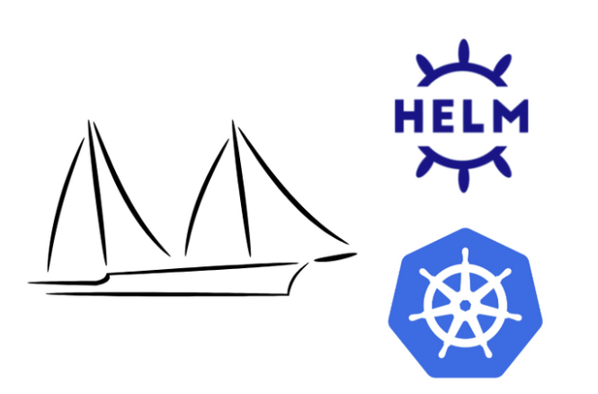

To effectively master the helm charts and its usage within Kubernetes, we can delve into specific sections and commands that Site Reliability Engineers (SREs) frequently encounter. Here's a detailed breakdown of the mentioned sections:

## **Section 1: Essential Helm Commands**

### **Core Helm Commands for Daily Use**

#### **Adding Helm Repositories**

To extend your Helm chart sources beyond the default settings, add repositories to your Helm client. This command allows you to access a variety of ready-to-use charts from external sources.
```
helm repo add bitnami https://charts.bitnami.com/bitnami
```
#### **Chart Management**

- **Create, Package, and Validate Charts**: These commands facilitate chart creation, packaging for distribution, and linting to validate chart correctness.
```
helm create <chart-name>
helm package <chart-directory>
helm lint <chart-directory>
```
- **Install, Upgrade, and Uninstall Releases**: Manage the lifecycle of your charts with these commands, which handle installation, upgrades, and clean removal of releases.
```
helm install <release-name> <chart> -n <namespace>
helm upgrade <release-name> <chart> -n <namespace>
helm uninstall <release-name> -n <namespace>
```
- **List, View History, and Manage Charts**: Keep track of all chart installations, review historical modifications, and perform rollbacks if necessary.
```
helm list -n <namespace>
helm history <release-name> -n <namespace>
helm rollback <release-name> <revision-number> -n <namespace>
helm repo add <repo-name> <url>
helm search repo <chart-name>
```
- **Manual Cleanup**: In cases where automated cleanup processes fail, particularly for resources stuck due to Helm hooks.
```
kubectl get jobs,configmaps,pods -l "helm.sh/hook" -n <namespace>
kubectl delete jobs,configmaps,pods -l "helm.sh/hook" -n <namespace>
```
- **Resetting a Helm Release**: For irrecoverable releases, manually remove Helm tracking. This should be used as a last resort due to its irreversible nature.
```
kubectl get secrets -n <namespace> | grep <release-name>
kubectl delete secret <secret-name> -n <namespace>
# **Caution**: This action causes Helm to lose track of the release.
```

- **Render Templates Locally for Review**: This command is useful for debugging and verifying how templates render with given values before going live.
```
helm template <chart-name> [chart-location] -f values.yaml
```

- **Display and Test Chart Values**: Examine the default and active values within a chart, and perform defined tests to ensure expected operation.
```
helm show values <chart-name>
helm test <release-name> -n <namespace>
```

- **Health Check Steps**: Utilize these commands to monitor and maintain the health of Helm deployments, ensuring configurations are as expected.
```
helm list -A | tee helmlist.txt
helm list -A | awk '{print "helm history " $1 " -n " $2}' | grep -v NAME | while read line; do echo $line | awk '{print $3}'; $line; echo -ne '\n'; done | tee upgradeshistory.txt
helm list -A | awk '{print "helm get values --all " $1 " -n " $2}' | grep -v NAME | while read line; do echo $line | awk '{print $5}'; $line; echo -ne '\n'; done | tee valuesall.txt
```

- **Fetching and Unpacking Charts**: Access and inspect chart contents directly from repositories for detailed examination of its structure and components.
```
helm fetch stable/pgadmin --untar
```

For a visual and comprehensive command reference, see the [Helm Commands Cheat Sheet](https://phoenixnap.com/kb/helm-commands-cheat-sheet).

## **Section 2: Managing CRDs with Helm Charts

CRDs are typically housed within a Helm chart in a directory named `crds/`. The placement of CRDs in this specific directory ensures that they are installed or upgraded in the Kubernetes cluster prior to any dependent resources. This preemptive action prevents errors during the installation of dependent resources that assume the CRDs already exist.

#### **Behavior Across Helm Versions:**

- **Helm 2:** In this version, CRDs were often managed manually or embedded directly within the template files of a chart.
- **Helm 3:** This version introduced automatic CRD installation from the `crds/` directory upon initial chart installation. However, to prevent unintended impacts across the cluster, Helm 3 does not automatically upgrade CRDs with chart upgrades, necessitating manual management for changes.

#### **Key Considerations for CRD Management**:
- **Helm Upgrades**: CRDs are not upgraded by Helm when the chart is upgraded. This behavior prevents accidental changes that could be disruptive or destructive, considering that CRD changes can impact existing resources:
- **Avoiding Resource Orphans** :When a Helm release is deleted, the CRDs are not removed, which means any custom resources created will remain as orphans unless manually cleaned up
- - **CRD Updates and Management**: Direct updates to CRDs via Helm are risky due to their potential cluster-wide impact. It is advisable to handle CRD updates manually or through specific operational workflows to mitigate risks.
- **Version Compatibility**: Ensure that the CRD definitions are compatible with the Kubernetes cluster version to avoid deployment issues.


## **Section 3: Considerations on Helm Chart Management **

### **Namespace and Release Management**

- **Can the same release names be used in different namespaces?** Yes, Helm allows the same release name to be used across different namespaces. This is beneficial for maintaining consistent naming conventions across multiple environments.

- **How do you create a namespace during chart installation?** You can create a namespace as part of the installation process with the following command:
```
helm install mysql devopspilot/mysql -n database --create-namespace
```

### **Template Functions and Utilities in Helm Charts**

- **What common functions are used in Helm templates?** Functions such as `default`, `lookup`, `eq`, `ne`, `lt`, `gt`, `and`, `or` are commonly used to manipulate and compare data within templates. These functions are documented in the [Helm Template Guide](https://helm.sh/docs/chart_template_guide/functions_and_pipelines/).

- **What is the purpose of `_helpers.tpl` in Helm charts?** The `_helpers.tpl` file is used to define reusable template snippets and functions. These can be included across various template files within the chart to maintain clean and DRY (Don't Repeat Yourself) code.

### **Advanced Configuration and Management**

- **How are environment-specific configurations managed in Helm?** Environment-specific configurations are managed by using separate `values.yaml` files for each environment. This allows for tailored settings per deployment without altering the core chart templates.

- **How are flow controls used in Helm templates?** Flow controls such as `if/else`, `with`, and `range` are used to create conditional blocks and iterate over data sets within templates, providing dynamic content generation based on input values. These are detailed in the [Helm Control Structures Documentation](https://helm.sh/docs/chart_template_guide/control_structures/).

### **Operational Considerations**

- **What are the default timeout settings for Kubernetes operations in Helm, and how can they be adjusted?** The default timeout for Kubernetes operations is 5 minutes. This can be extended by passing the `--timeout` flag, useful for operations that require more time to complete:
```
helm install mysql devopspilot/mysql -n database --timeout 10m
```
- **How can you skip hooks during a Helm installation?** To skip hooks during installation, use the `--no-hooks` flag:
```
helm install easyclaim-backend devopspilot/easyclaim-backend --no-hooks
```
### **Chart Dependency and Repository Management**

- **How are chart dependencies managed?** Chart dependencies are specified in the `Chart.yaml` file and require synchronization through the Helm dependency management system:
```
helm dependency update
```
  
- **How can charts be pushed to repositories like JFrog Artifactory?** Charts can be packaged and pushed to artifact repositories to facilitate sharing and deployment across different environments. Commands for packaging and pushing depend on the specific repository's API and configuration. Helm typo repo should be created in the Artifactory in advance.

## **Section 4: Helm Version Comparison and Chart Version Upgrade**

### **Comparison of Helm 2 and Helm 3**

#### **Major Differences**

- **Tiller Removal**: Helm 3 removed Tiller, the cluster-side component of Helm 2, which was responsible for managing Helm chart releases. This change enhances security and simplifies the Helm architecture by making Helm client-only.

- **Release Management**: In Helm 2, releases were stored in the Tiller namespace. Helm 3 stores release information in the same namespace as the release, making it easier to manage releases on a namespace-by-namespace basis.

- **Secrets as the Default Storage**: Helm 3 uses Secrets as the default storage driver for release information, whereas Helm 2 used ConfigMaps.

- **Improved Upgrade Strategy**: Helm 3 handles upgrades more cleanly by tracking release versions more accurately and simplifying the rollback process.

- **CRD Management**: Helm 3 supports better management of CRDs by automatically installing CRDs on `helm install` and not updating them on `helm upgrade`, reducing the risk of unintended side effects.

#### **Command Syntax Changes**

Some Helm commands also received syntax and functionality changes from Helm 2 to Helm 3:

- The `delete` command was renamed to `uninstall`.
- The `--purge` flag is no longer needed with `helm uninstall` because it is the default behavior now.
- The `helm reset` command, which was used to remove Tiller, is removed in Helm 3.

### **Upgrading Helm Charts from Helm 2 to Helm 3**

- **Install Helm 3:** You can install Helm 3 alongside Helm 2. They can coexist, allowing you to migrate at your own pace.
```
# You can download it from the Helm GitHub page or use package managers: brew install helm`
helm3 plugin install https://github.com/helm/helm-2to3.git
```

- **Migrate Local Configuration:**
```
helm 2to3 move config
# This command will migrate Helm configuration files and local data
```

- **Migrate Releases:** For each release managed by Helm 2, you need to convert them to Helm 3:
```
helm 2to3 convert <RELEASE_NAME>
# Repeat this for each release. This step converts and migrates the release metadata from Helm 2 to Helm 3
```

- **Cleanup Tiller:**
```
helm 2to3 cleanup
# This command will remove Tiller from your cluster and also clean up other Helm 2 data if no longer needed
```

- **Verify Migration:** List all Helm 3 releases and verify that all expected releases are correctly migrated and appear in the list:
```
helm ls -A
```

If you have CI/CD pipelines or scripts that use Helm, make sure to update them to use Helm 3 commands and syntax. This includes changing deployment scripts, CI configurations, and any automated tooling that interacts with Helm

## **Section 5: Finding Resources and Examples to Customize your Helm Charts**

- **Helm Documentation**: The official Helm documentation provides comprehensive guides and examples on how to create and manage charts. It's a great starting point for understanding how to structure your templates and utilize Helm's capabilities.

- **GitHub Repositories**: Many open-source projects and companies share their Helm charts on GitHub. You can search for Helm charts to see how others are structuring their charts and managing complex configurations. For example, the [Bitnami Charts](https://github.com/bitnami/charts) repository is a well-maintained collection of popular applications.

- **Artifact Hub**: Visit [Artifact Hub](https://artifacthub.io/), where you can find and explore a large number of Helm charts published by the community and software vendors. It's an excellent resource for discovering charts that may suit your needs or provide inspiration for your own charts


